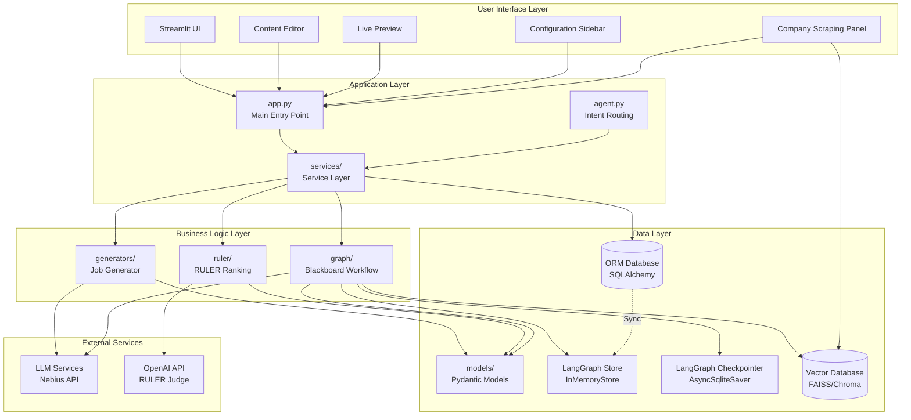
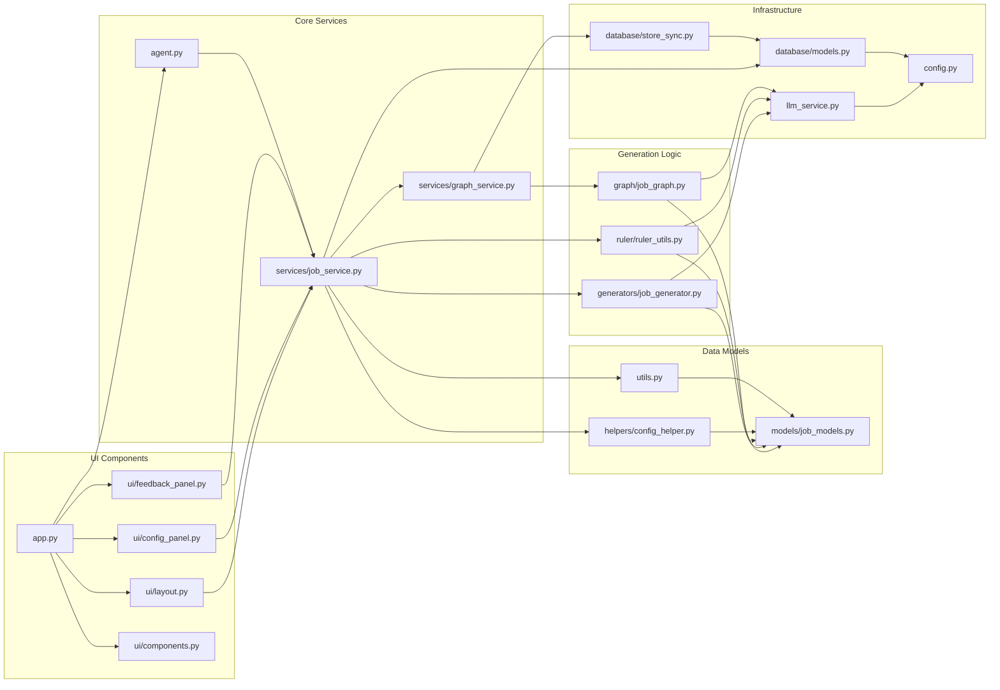
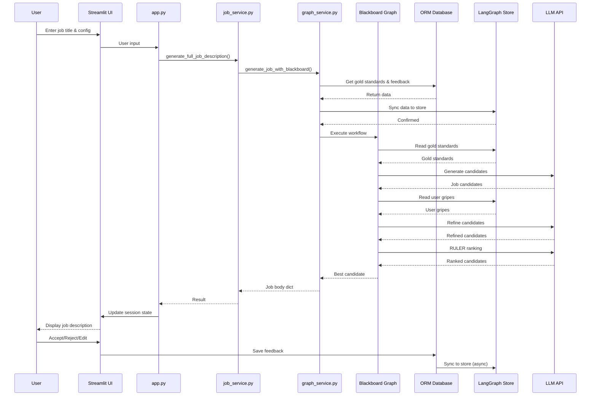
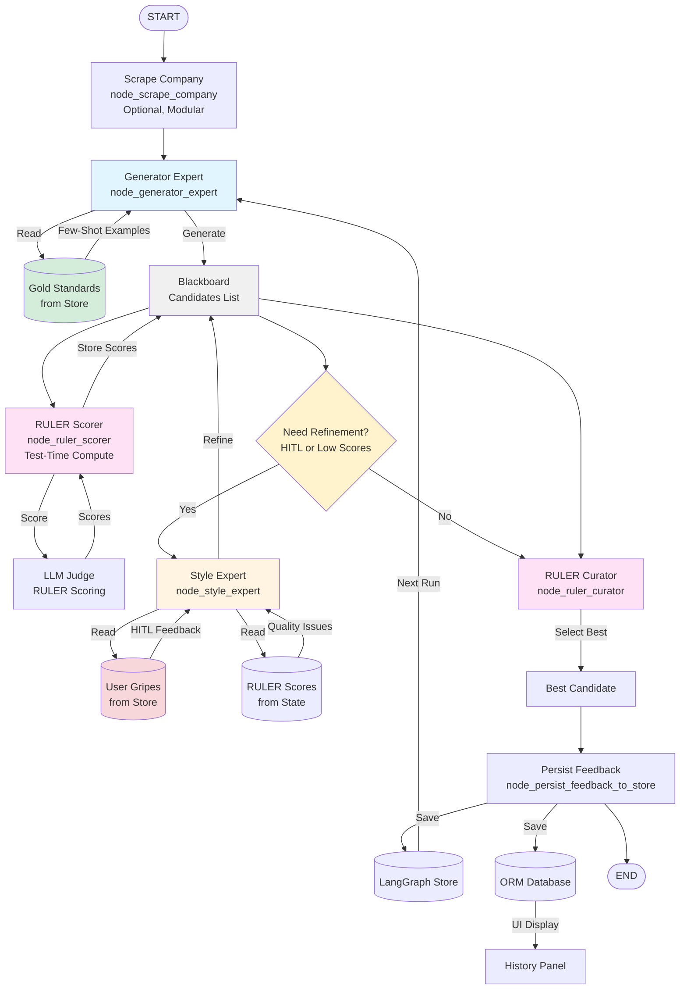
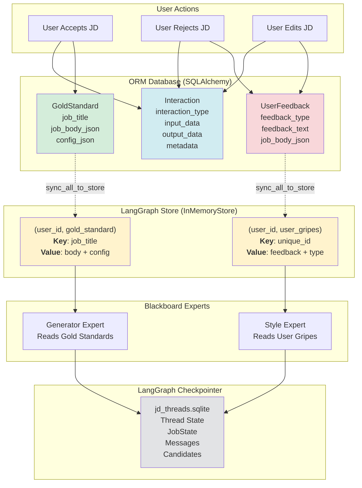
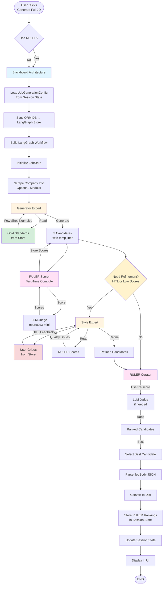
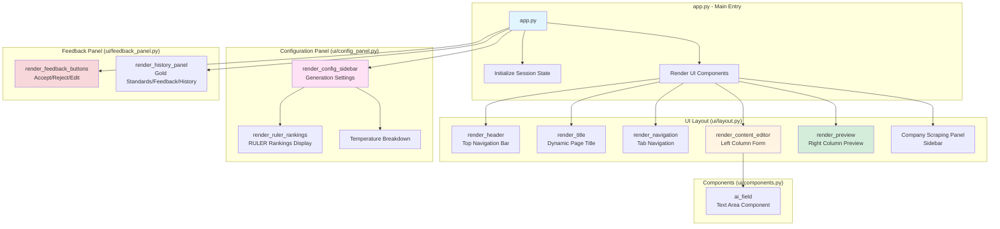
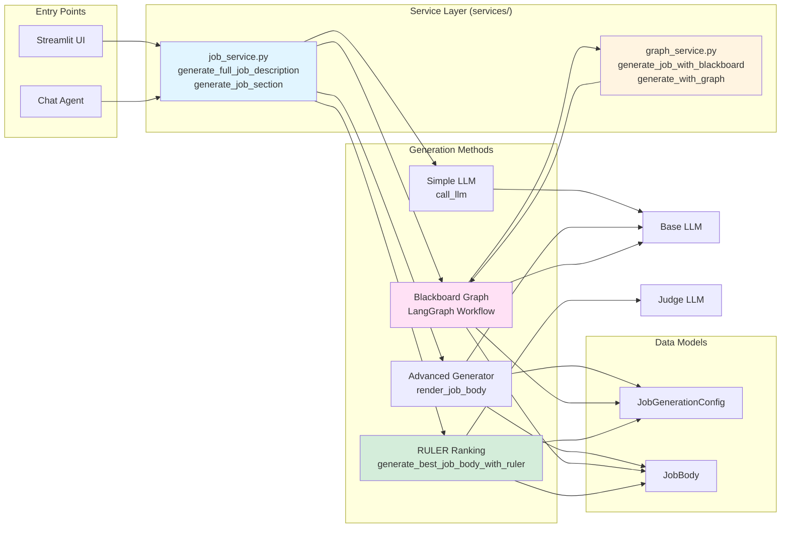
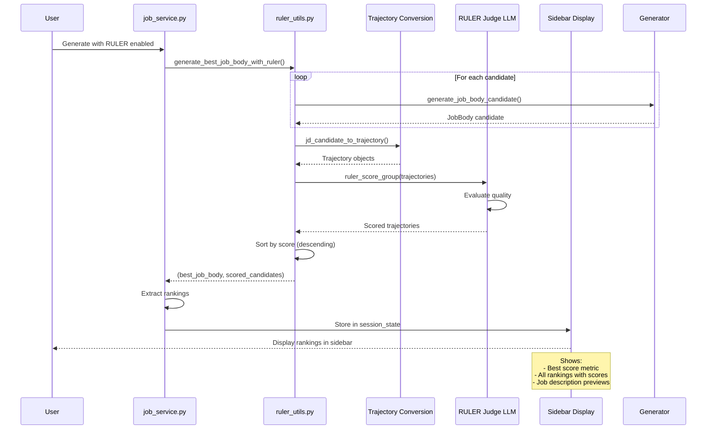
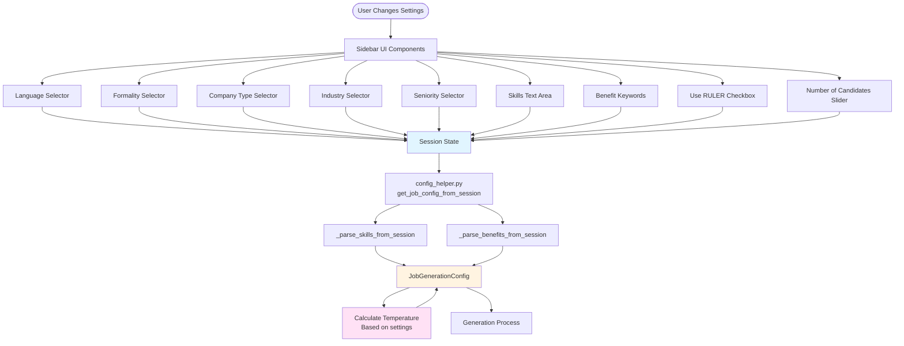

# Application Architecture Diagrams

This document provides visual representations of the Job Description Writer application architecture using Mermaid diagrams.

## Table of Contents

1. [System Overview](#system-overview)
2. [Component Architecture](#component-architecture)
3. [Data Flow Diagram](#data-flow-diagram)
4. [Blackboard Architecture Workflow](#blackboard-architecture-workflow)
5. [Database & Memory Architecture](#database--memory-architecture)
6. [Generation Pipeline](#generation-pipeline)
7. [UI Component Structure](#ui-component-structure)

---

## System Overview

---

## Component Architecture

---

## Data Flow Diagram

---

## Blackboard Architecture Workflow

---

## Database & Memory Architecture

---

## Generation Pipeline

---

## UI Component Structure

---

## Service Layer Architecture

---

## RULER Ranking Flow

---

## Configuration Flow

---

## Notes

- All diagrams use Mermaid syntax and can be rendered in:
  - GitHub/GitLab markdown viewers
  - VS Code with Mermaid extension
  - Online Mermaid editors (mermaid.live)
  - Documentation platforms (MkDocs, Sphinx with extensions)

- Colors in diagrams:
  - Blue: UI/Entry points
  - Yellow: Generation/Processing
  - Pink: RULER/Quality evaluation
  - Green: Data storage
  - Red: Feedback/Errors

- For interactive viewing, copy the Mermaid code blocks to [mermaid.live](https://mermaid.live) or use a Mermaid-compatible viewer.

