# Marketing Psychology — Motivkompass Style System

> **What it is:** A psychology-based persuasion layer that automatically adapts
> the tone, language, and structure of generated job descriptions to resonate
> with specific audience types — using the Motivkompass 4-color model from
> selling psychology research.

---

## 1. The Motivkompass Model

The system uses a **4-color persuasion taxonomy** (Motivkompass) mapped to
two behavioral axes:

|                | **Objektbezug** (fact-oriented) | **Personenbezug** (people-oriented) |
|----------------|--------------------------------|--------------------------------------|
| **Proaktiv** (active)    | 🔴 **Red — Macher**     | 🟡 **Yellow — Entertainer**          |
| **Reaktiv** (reflective) | 🔵 **Blue — Denker**    | 🟢 **Green — Bewahrer**              |

### Color Profiles at a Glance

| Color  | Archetype    | Prefers                                            | Avoids                             |
|--------|--------------|----------------------------------------------------|-------------------------------------|
| 🔴 Red    | **Macher**      | Speed, power, status, direct benefit, results       | Passive voice, committee-speak      |
| 🟡 Yellow | **Entertainer** | Freedom, fun, creativity, variety, team spirit      | Rigidity, formality, bureaucracy    |
| 🔵 Blue   | **Denker**      | Facts, structure, statistics, quality, evidence     | Vague superlatives, hype, filler    |
| 🟢 Green  | **Bewahrer**    | Harmony, trust, relationships, safety, belonging    | Pressure, aggression, over-promising|

### The Two Axes

- **Proaktiv** → Short declarative sentences, active voice, imperatives allowed
- **Reaktiv** → Longer connected sentences, conditional/inclusive phrasing
- **Personenbezug** → "you/we" framing, emotional cues, community language
- **Objektbezug** → Third-person, evidence, data, process-oriented language

---

## 2. How Style is Applied

Style in this system is **not** an agent's personality — it is a **parameter
of the writing task**. Each agent has a fixed operating character (concise,
reliable, non-theatrical), while the style profile is injected as structured
data that shapes the output.

### The StyleKit

The `StyleKit` is the compact instruction set that gets injected into every
generation prompt. It contains:

| Component              | Count    | Example                                          |
|------------------------|----------|--------------------------------------------------|
| **Do / Don't rules**   | 6–10     | "DO: Use facts and evidence" / "DON'T: Use hype" |
| **Preferred adjectives**| 10–20   | "analytisch, strukturiert, fachkundig, präzise"   |
| **Hook templates**     | 3–6      | "Exzellenz durch Expertise."                      |
| **Syntax constraints** | 2–4      | "Short declarative sentences — SVO"               |
| **Hard constraints**   | 0–n      | "⚠️ no pressure language"                         |

The `StyleKit.to_prompt_block(lang)` method renders this into a Markdown block
that is injected directly into the LLM prompt, right before the examples section.

---

## 3. End-to-End Architecture

### High-Level Flow

```mermaid
flowchart TD
    subgraph INPUT["📥 User Input"]
        JC[JobGenerationConfig<br/>industry · company_type<br/>formality · seniority]
    end

    subgraph STYLE["🎨 Style Pipeline"]
        SR[Style Router<br/><i>Scoring rubric</i>]
        RAG[(FAISS Vector Store<br/><i>68 style chunks from<br/>Motivkompass PDFs</i>)]
        RET[Style Retriever<br/><i>Assemble StyleKit</i>]
        SK[StyleKit<br/><i>do/dont · adjectives<br/>hooks · syntax</i>]
    end

    subgraph GENERATION["✍️ Generation Pipeline"]
        GEN[Generator Expert<br/><i>3 candidates with<br/>temperature jitter</i>]
        RULER[RULER Scorer<br/><i>Test-time compute</i>]
        SE[Style Expert<br/><i>HITL refinement</i>]
        CUR[Curator<br/><i>Best candidate selection</i>]
    end

    subgraph OUTPUT["📤 Output"]
        JD[Final Job Description]
    end

    JC --> SR
    SR -->|StyleProfile| RET
    RAG -.->|chunks by color<br/>+ dimension| RET
    RET --> SK
    SK -->|injected into prompt| GEN
    GEN --> RULER
    RULER --> SE
    SE --> CUR
    CUR --> JD

    style SR fill:#4a90d9,color:#fff
    style RAG fill:#f5a623,color:#fff
    style RET fill:#7b68ee,color:#fff
    style SK fill:#50c878,color:#fff
    style GEN fill:#e74c3c,color:#fff
    style RULER fill:#9b59b6,color:#fff
```

### LangGraph Execution Order

Key points:
- **`style_router`** and **`scrape_company`** run **in parallel** from START
- The generator **waits** for the style router to finish (it needs the `StyleKit`)
- The `ruler_scorer` waits for both the generator and scraper to join
- Conditional edges decide whether refinement / re-scoring is needed

---

## 4. The Style Router — How a Profile is Chosen

The Style Router uses a **deterministic scoring rubric**, not hard-mapping.
No LLM call is needed — all logic is auditable.

### Scoring Signals

Weights are accumulated from four dimensions of the `JobGenerationConfig`:

```mermaid
flowchart TD
    subgraph SIGNALS["📊 Input Signals"]
        IND[Industry<br/><i>finance · healthcare<br/>ai_startup · ecommerce · …</i>]
        CT[Company Type<br/><i>startup · corporate<br/>agency · consulting · …</i>]
        FM[Formality<br/><i>casual · neutral · formal</i>]
        SN[Seniority<br/><i>intern · junior · mid<br/>senior · lead · principal</i>]
    end

    subgraph SCORING["⚖️ Weight Accumulation"]
        ACC[Score Accumulator<br/><code>red: 0.0 · yellow: 0.0<br/>green: 0.0 · blue: 0.0</code>]
        BIAS[Default Blue Bias<br/><code>blue += 0.10</code>]
    end

    subgraph DECISION["🎯 Decision"]
        PRIMARY[Primary = argmax]
        SECONDARY[Secondary = runner-up<br/><i>only if within margin 0.15</i>]
        AXES[Derive Axes<br/><i>proaktiv/reaktiv ×<br/>person/objektbezug</i>]
    end

    IND --> ACC
    CT --> ACC
    FM --> ACC
    SN --> ACC
    ACC --> BIAS
    BIAS --> PRIMARY
    PRIMARY --> SECONDARY
    SECONDARY --> AXES
    AXES --> SP[StyleProfile]

    style ACC fill:#3498db,color:#fff
    style PRIMARY fill:#e74c3c,color:#fff
    style SP fill:#2ecc71,color:#fff
```

### Example Weight Table

| Signal              | 🔴 Red  | 🟡 Yellow | 🔵 Blue  | 🟢 Green |
|---------------------|---------|-----------|----------|----------|
| industry=`finance`  |         |           | +0.40    | +0.20    |
| industry=`ai_startup`|        | +0.30     |          |          |
| company_type=`startup`| +0.20 | +0.30     |          |          |
| company_type=`corporate`|     |           | +0.30    | +0.20    |
| formality=`casual`  | +0.10  | +0.30     |          |          |
| formality=`formal`  |         |           | +0.30    | +0.20    |
| seniority=`lead`    | +0.30  |           | +0.20    |          |
| seniority=`intern`  |         | +0.20     |          | +0.30    |
| **Default bias**    |         |           | **+0.10**|          |

### Composite Scenario

> **Input:** `industry=finance`, `company_type=corporate`, `formality=formal`, `seniority=senior`
>
> | Color  | Accumulated Score |
> |--------|-------------------|
> | 🔵 Blue   | 0.40 + 0.30 + 0.30 + 0.20 + 0.10 = **1.30** |
> | 🟢 Green  | 0.20 + 0.20 + 0.20 = **0.60** |
> | 🔴 Red    | 0.10 = **0.10** |
> | 🟡 Yellow | 0.00 = **0.00** |
>
> **Result:** Primary = 🔵 Blue, Secondary = 🟢 Green (gap 0.70 > margin 0.15 → no secondary)
>
> **Axes:** reaktiv + objektbezug → longer sentences, evidence-based, factual

---

## 5. The Style Retriever — How the StyleKit is Assembled

Once the Style Router picks a color profile, the Style Retriever assembles
a concrete `StyleKit` by querying the FAISS vector store.

### Data Flow

```mermaid
flowchart TD
    SP[StyleProfile<br/><i>primary=blue<br/>secondary=green</i>]

    subgraph RAG["🗄️ FAISS Vector Store"]
        direction TB
        H["hooks<br/><i>Job-ad openers per color</i>"]
        A["adjectives<br/><i>Persuasion words per color</i>"]
        S["syntax<br/><i>Sentence structure rules</i>"]
        DD["do_dont<br/><i>Marketing approach rules</i>"]
        V["visuals<br/><i>Color & imagery cues</i>"]
    end

    SP -->|query by<br/>company=style_blue| RAG
    SP -->|query by<br/>company=style_syntax| RAG

    RAG --> FILL[Assemble StyleKit]

    subgraph FALLBACK["🔄 Fallback"]
        DEF[Hardcoded Defaults<br/><i>EN + DE per color</i>]
    end

    FILL -->|enough chunks?| SK[StyleKit ✓]
    FILL -->|too few chunks| DEF --> SK

    SK --> PROMPT["to_prompt_block(lang)<br/><i>Injected into LLM prompt</i>"]

    style RAG fill:#f5a623,color:#fff
    style SK fill:#50c878,color:#fff
    style DEF fill:#95a5a6,color:#fff
```

### How Chunks are Stored

Each chunk in the vector store has structured metadata:

| Field          | Values                                     | Example                      |
|----------------|--------------------------------------------|------------------------------|
| `company_name` | `style_red`, `style_blue`, `style_syntax`  | `style_blue`                 |
| `profile_color`| `red`, `yellow`, `green`, `blue`, `any`    | `blue`                       |
| `dimension`    | `hooks`, `adjectives`, `syntax`, `do_dont`, `visuals` | `adjectives`     |
| `language`     | `de`, `en`                                 | `de`                         |
| `use_case`     | `job_ads`, `general_marketing`             | `job_ads`                    |
| `mode`         | `proaktiv`, `reaktiv` (syntax only)        | `reaktiv`                    |

The retriever queries:
1. `style_{primary_color}` — all dimensions for the primary color
2. `style_{secondary_color}` — if a secondary exists (limited to 2 adjectives + 1 hook)
3. `style_syntax` — mode-specific sentence structure rules

---

## 6. PDF Ingestion Pipeline

The Motivkompass data originates from German selling-psychology PDFs that are
extracted, chunked, and embedded once — then served from the vector store at runtime.

### Ingestion Flow

```mermaid
flowchart LR
    subgraph SOURCE["📚 Source PDFs (German)"]
        P1["Psychologische<br/>Farbprofile"]
        P2["Botschaften &<br/>Hooks"]
        P3["Passende<br/>Adjektive"]
        P4["Satzstruktur"]
        P5["Allgemeine<br/>Tipps"]
    end

    subgraph EXTRACT["🔍 Extraction"]
        EXT[pdf_ingestion.py<br/><i>pdfminer.six</i>]
        NORM[Unicode<br/>Normalization<br/><i>NFD → NFC</i>]
    end

    subgraph CHUNK["📦 Chunking"]
        SC["StyleChunk<br/><i>content + metadata</i>"]
        JSONL["style_chunks.jsonl<br/><i>68 chunks · ~23 KB<br/>committed to repo</i>"]
    end

    subgraph EMBED["🧮 Embedding"]
        EMB["OpenAI Embeddings<br/><i>text-embedding-3-small<br/>via OpenRouter</i>"]
        FAISS["FAISS Index<br/><i>vector_store/faiss_index/</i>"]
    end

    P1 & P2 & P3 & P4 & P5 --> EXT
    EXT --> NORM --> SC --> JSONL --> EMB --> FAISS

    style JSONL fill:#f5a623,color:#fff
    style FAISS fill:#3498db,color:#fff
    style EXT fill:#e74c3c,color:#fff
```

### Extraction Strategy by PDF

| PDF Document                                | Extractor Function                   | Chunk Type(s)         |
|---------------------------------------------|--------------------------------------|-----------------------|
| Psychologische Farbprofile (Red/Yellow/Blue/Green) | `_extract_visual_cues`       | `visuals`             |
| Botschaften, Hooks für Stellenanzeigen      | `_extract_hooks`                     | `hooks`               |
| Passende Adjektive zum … Motivfeld          | `_extract_adjectives`                | `adjectives`          |
| Motivkompassansprache (Satzstruktur)        | `_extract_syntax_rules`              | `syntax`              |
| Allgemeine Tipps zum Umgang mit …           | `_extract_general_tips`              | `do_dont`             |
| Motivkompass Übersicht                      | `_extract_motivkompass_overview`     | `do_dont`             |

---

## 7. Deployment & Self-Healing Index

The style index is designed to be **zero-configuration** in production:

```mermaid
flowchart TD
    BOOT["🚀 App Startup<br/><code>ensure_style_index()</code>"]

    BOOT --> CHECK{FAISS index<br/>exists?}

    CHECK -->|yes| LOAD["✓ Load existing index<br/><i>No API calls needed</i>"]
    CHECK -->|no| JSONL{style_chunks.jsonl<br/>exists?}

    JSONL -->|yes| EMBED["Embed from JSONL<br/><i>~68 chunks · ~2 seconds<br/>One embedding API call</i>"]
    JSONL -->|no| PDFS{Source PDFs<br/>available?}

    PDFS -->|yes| EXTRACT["Extract PDFs →<br/>write JSONL →<br/>embed into FAISS"]
    PDFS -->|no| DEFAULT["Use hardcoded<br/>defaults<br/><i>Still fully functional</i>"]

    EMBED --> PERSIST["Save to<br/>persistent volume"]
    EXTRACT --> PERSIST

    LOAD --> READY["✅ Style system ready"]
    PERSIST --> READY
    DEFAULT --> READY

    style BOOT fill:#3498db,color:#fff
    style READY fill:#27ae60,color:#fff
    style DEFAULT fill:#95a5a6,color:#fff
    style EMBED fill:#f5a623,color:#fff
```

### Graceful Degradation

The system works at **three levels of capability**:

| Level | Condition | Style Source | Quality |
|-------|-----------|-------------|---------|
| **Full RAG** | FAISS index + embeddings available | Vector store (68 chunks from PDFs) | ★★★ Best — real Motivkompass data |
| **Hardcoded defaults** | No vector store, but code is present | Built-in EN + DE defaults per color | ★★ Good — manually curated |
| **No style** | `StyleKit` is `None` | No style block in prompt | ★ Functional — generic tone |

---

## 8. Conflict Resolution

When constraints from different sources conflict, they are resolved in
strict precedence order:

```mermaid
flowchart TD
    L["1. ⚖️ Legal & Ethics<br/><i>Always wins</i>"] --> B["2. 🏢 Brand Voice<br/><i>Company-specific overrides</i>"]
    B --> R["3. 👤 Role Requirements<br/><i>Seniority, industry norms</i>"]
    R --> P["4. 🎨 Persuasion Profile<br/><i>Motivkompass style</i>"]

    style L fill:#c0392b,color:#fff
    style B fill:#e67e22,color:#fff
    style R fill:#2980b9,color:#fff
    style P fill:#27ae60,color:#fff
```

**Example:** If the persuasion profile says "use pressure language" (Red / Macher)
but legal constraints say "no pressure", legal wins — the `StyleKit` includes
it as a hard constraint: `⚠️ no pressure language`.

---

## 9. UI Integration

The Streamlit sidebar displays the style routing result in real-time:

- **Color indicator:** 🔴🟡🔵🟢 with primary (and optional secondary) color
- **Axes:** interaction mode (`proaktiv`/`reaktiv`) + reference frame (`personenbezug`/`objektbezug`)
- **Expandable breakdown:** Full scoring rationale showing which signals contributed
  what weight to each color

This gives the user full transparency into *why* a particular style was chosen,
making the system auditable and adjustable.

---

## 10. File Reference

| File | Purpose |
|------|---------|
| `models/job_models.py` | `StyleProfile` and `StyleKit` Pydantic models |
| `services/style_router.py` | Deterministic scoring rubric → `StyleProfile` |
| `services/style_retriever.py` | RAG retrieval + defaults → `StyleKit` |
| `services/pdf_ingestion.py` | PDF extraction → atomic `StyleChunk` objects |
| `services/startup.py` | Self-healing index builder + singleton cache |
| `graph/job_graph.py` | `node_style_router` — LangGraph integration |
| `generators/job_generator.py` | `StyleKit.to_prompt_block()` injection into prompts |
| `ui/config_panel.py` | Sidebar display of style profile + routing breakdown |
| `style_chunks.jsonl` | Pre-extracted chunks (committed, ~23 KB) |
| `AGENTS.md` | Workflow contracts and hard rules |
| `SKILLS.md` | Full scoring tables and tuning guide |
